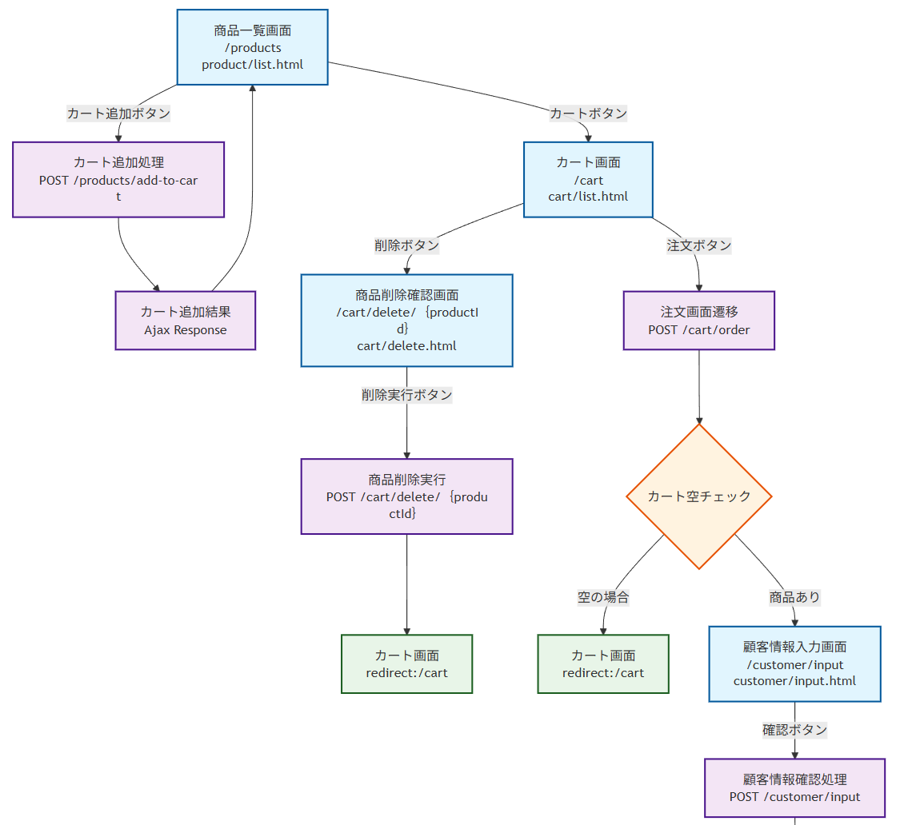

# 概要
Mermaid.js を利用して、PukiWiki ページ内にフローチャートなどの図を簡単に描画できる PukiWiki プラグインです。  
`#mermaid()` によるシンプルな記述で、Mermaid.js 記法に基づく図を表示できます。

---

# スクリーンショット
  
※ スクリーンショット画像は適宜差し替えてください。

---

# インストール方法

## プラグインの配置
1. `plugin_mermaid.inc.php` を PukiWiki の `plugin/` ディレクトリに配置します。

## JavaScript有効化（PukiWiki 1.5.1 以下必須）
PukiWiki 1.5.1 以前のバージョンでは、`pukiwiki.ini.php` に以下の定義が必要です：

```php
define('PKWK_ALLOW_JAVASCRIPT', 1);
````

参考：[PukiWiki 1.5.2 変更履歴](https://pukiwiki.sourceforge.io/?:PukiWiki/Download/1.5.2/Changes#q=PKWK_ALLOW_JAVASCRIPT)

---

# 記述方法

ブロックプラグインとして次のように記述します：

```pukiwiki
#mermaid(){{
flowchart TD
  A --> B
  B --> C
}}
```

## 幅指定

幅を指定することも可能です（単位省略時は `px` と解釈されます）：

```pukiwiki
#mermaid(500px){{
flowchart TD
  A --> B
  B --> C
}}

#mermaid(500){{
flowchart TD
  A --> B
  B --> C
}}

#mermaid(70%){{
flowchart TD
  A --> B
  B --> C
}}
```

---

# ダウンロード方法

GitHubから `plugin_mermaid.inc.php` をダウンロードしてください。
ファイル1つを `plugin/` に配置するだけです。

---

# ライセンス

GPL ライセンスに基づき公開します。

---

# 参考情報：Mermaid.js をローカル配置する方法

デフォルトでは CDN 経由で以下の URL から `mermaid.min.js` を読み込みます：

```
https://cdn.jsdelivr.net/npm/mermaid/dist/mermaid.min.js
```

オフライン環境や特定バージョンを固定したい場合は以下の手順で Mermaid.js をローカル配置できます。

## 手順

1. **Mermaid.js ファイルを取得**

   * 公式リポジトリまたは CDN から任意バージョンの `mermaid.min.js` をダウンロード：

     ```
     https://cdn.jsdelivr.net/npm/mermaid@<version>/dist/mermaid.min.js
     ```

2. **PukiWiki 内の適当な場所に配置**
   例：

   ```
   pukiwiki/skin/mermaid/mermaid.min.js
   ```

3. **プラグインコードの修正**
   `plugin_mermaid.inc.php` の以下の部分を変更：

   ```php
   // 元の記述（CDN版）
   <script src="https://cdn.jsdelivr.net/npm/mermaid/dist/mermaid.min.js"></script>

   // 修正例（ローカル版）
   <script src="skin/mermaid/mermaid.min.js"></script>
   ```

4. **キャッシュ対策（任意）**
   バージョンを固定したい場合、`mermaid.min.js` にバージョン名を付けてもOK：
   例：`mermaid-10.9.0.min.js`

